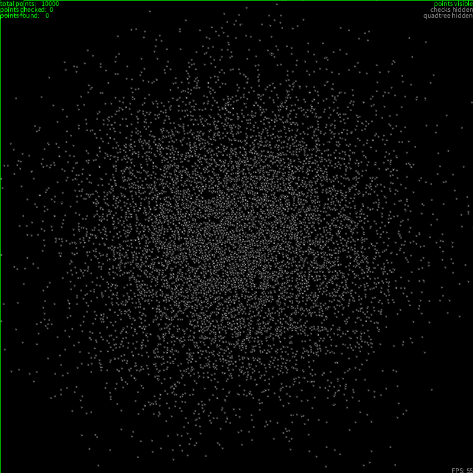

# Random Visualizations
Some visualizations of algorithms and math made in processing / java

## Mandelbrot & Julia

A simple visualization of the [Mandelbrot-Set](https://en.wikipedia.org/wiki/Mandelbrot_set). Any complex number $c$ is part of the set, if the function $f(z) = z^2 + c$ starting from $z_0 = 0$ does not diverge. The interactive part is inspired by [Ben Sparks](https://www.youtube.com/watch?v=FFftmWSzgmk) work. The mouse position corresponds to the value of $c$, while the points on the graph represent the values for $z$ for iteration 0 to 10. Numbers that are part of the set are colored black, while for any other number, the color represents the number of iterations it takes for $z$ to reach infinity[^1]. 

On the right side is the corresponding [Julia-Set](https://en.wikipedia.org/wiki/Julia_set). It uses the same formula as the Mandelbrot-Set, but instead of starting at $z_0 = 0$ every complex number is considered. The constant $c$ is still arbitrary chosen.

The graph for the first 10 values of $z$ for every given $c$ is only shown on the Mandelbrot-Set and can be disabled by pressing ``x``. 

## Raycasting

This is a recreation of the [Coding challange #146](https://www.youtube.com/watch?v=vYgIKn7iDH8&t=578s) from codingtrain. I might expand this further in the future. Basic movement is possible via ``WASD``. I could integrate the maze creating algorithm to have a more interesting scene.

## Labyrinth creating algorithm

A simple [recursive backtracking algorithm using depth first search](https://en.wikipedia.org/wiki/Maze_generation_algorithm#Recursive_implementation) to generate a maze. Recreation of [Coding Challange #10](https://www.youtube.com/watch?v=HyK_Q5rrcr4) from codingtrain.

## Quadtree

Another codingtraing Coding [Challenge](https://www.youtube.com/watch?v=OJxEcs0w_kE&t=736s) (#98). Here it's to demonstrate the [Quadtree](https://en.wikipedia.org/wiki/Quadtree) data-structure, to minimize the load of other algorithms. 

## Rose

Still have to find the name of this thing. The idea is basically to have a circle of radius $r$ be bounded by $n$ tangents. The intersections of each tangent make a shape of $n$ vertices and $n$ edges. Each vertex lies on another circle, that is bound by $n+1$ tangents and so on. The radius $r_{n+1}$ is defined by $r_{n+1} = r_n \div \cos(\frac{\pi}{n})$.

Each shape rotates based on the number of vertices: if prime, it rotates clockwise, if even, it rotates counter-clockwise.

[^1]: infinity in this case is defined as a certain threshold, at wich the algorithm stops.