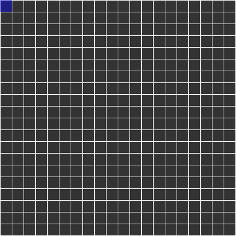

# Random Visualisations
Some visualisations of algorithms and math made in processing / java

## Labrith creating algorithm

A simple [recursive backtracking algorithm using depth first search](https://en.wikipedia.org/wiki/Maze_generation_algorithm#Recursive_implementation) to genereate a maze.

